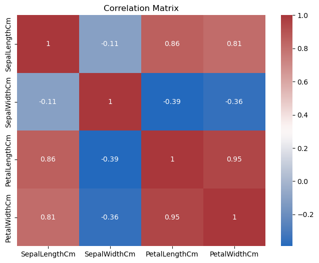
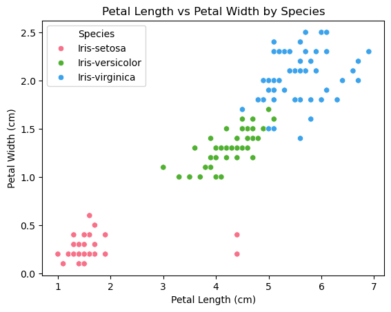

# Iris Dataset Classification – Logistic Regression vs KNN

[](https://colab.research.google.com/github/nikkibhoot-29/Iris-Classification-LogReg-vs-KNN/blob/main/notebooks/IRIS%20dataset%20-%20Analysis.ipynb)

Comparative classification analysis using Logistic Regression and K-Nearest Neighbors on the Iris dataset.

---

## Overview

The Iris dataset is a classic benchmark for classification problems, containing measurements of flower characteristics across three species.

This project applies two fundamentally different approaches:

* Logistic Regression (linear model)
* K-Nearest Neighbors (instance-based model)

The objective is to compare their performance and understand how model choice affects classification outcomes.

---

## Problem

Classify iris flowers into their respective species based on sepal and petal measurements, while evaluating the effectiveness of different classification techniques.

---

## Data

The dataset includes:

* Sepal length and width
* Petal length and width
* Species (target variable)

Basic preprocessing was applied to handle missing values and ensure consistency.

---

## Methodology

### Data Preparation

* Conversion of relevant columns to numeric format
* Removal of irrelevant columns
* Handling missing values using mean/median/mode

### Feature Scaling

* Standardization applied using `StandardScaler`

---

## Modeling

### Models Used

* Logistic Regression
* K-Nearest Neighbors (K=5)

---

## Evaluation

Models were evaluated using:

* Accuracy
* Confusion Matrix
* Classification Report

### Results

| Model               | Accuracy |
| ------------------- | -------- |
| Logistic Regression | ~94–95%  |
| K-Nearest Neighbors | ~92%     |

→ Logistic Regression performs slightly better due to the near-linear separability of the dataset.

---

## Key Insights

* Iris dataset exhibits strong class separability
* Logistic Regression performs well due to linear decision boundaries
* KNN performs competitively but is sensitive to local variations
* Feature scaling plays an important role in distance-based models like KNN

---

## Visual Insights

### Correlation Analysis  



### Feature Relationships  



---

## Execution

The project is implemented in:

* Jupyter Notebook (analysis & visualization)
* `main.py` (reproducible pipeline)

Install dependencies:

```bash
pip install -r requirements.txt
```

Run:

```bash
python main.py
```

---

## Tech Stack

Python · Pandas · NumPy · Scikit-learn · Matplotlib · Seaborn

---

## Closing Note

Even simple datasets can highlight important differences between modeling approaches.
This project emphasizes how model assumptions and data structure influence performance.
